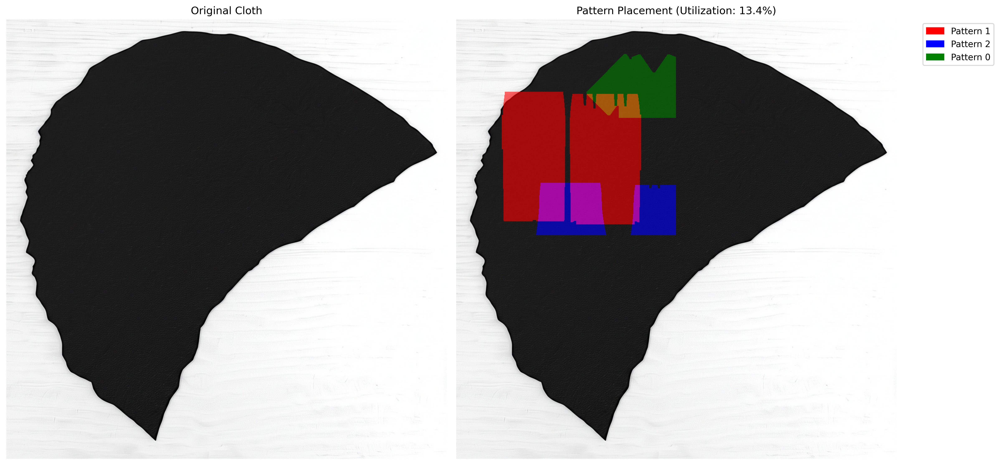
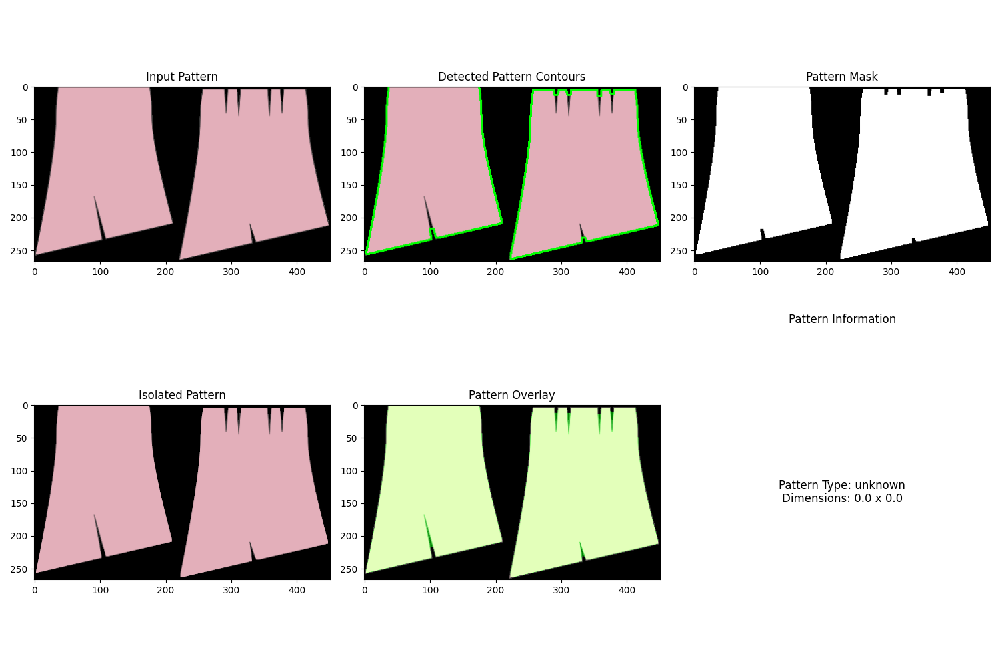
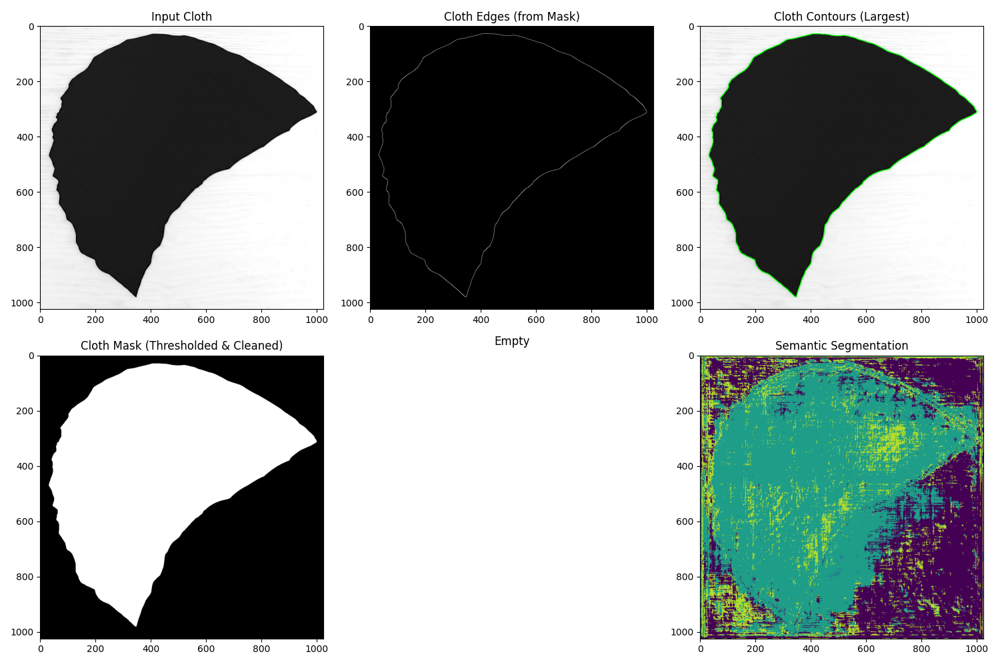
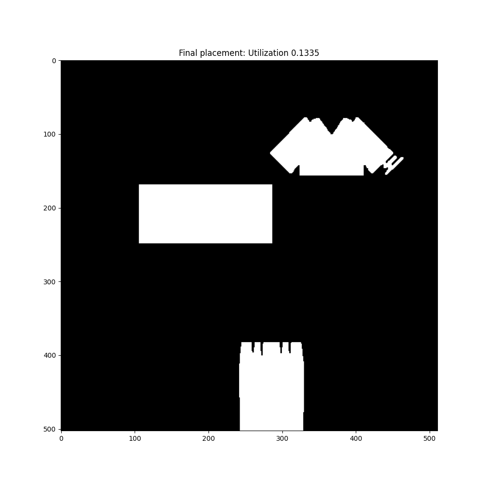

# Cutting Edge: Garment Pattern Recognition System

## Overview

Cutting Edge is a computer vision system that analyzes garment patterns and cloth materials using deep learning. The system helps in garment manufacturing by recognizing pattern types, detecting key features, and estimating dimensions for optimal pattern placement on cloth materials to minimize waste.

The system uses Hierarchical Reinforcement Learning to optimize pattern placement, resulting in better material utilization and reduced fabric waste during garment production.



## Features

- **Pattern Recognition**: Identifies pattern types from images using ResNet50 architecture
- **Cloth Material Analysis**: Analyzes cloth properties and contours using EfficientNet and U-Net
- **Dimension Estimation**: Extracts accurate measurements for both patterns and cloth
- **Pattern Fitting**: Optimizes pattern placement on cloth using Hierarchical Reinforcement Learning
- **Material Utilization**: Maximizes cloth utilization and minimizes waste using optimization algorithms

## How It Works

### 1. Pattern Recognition Module

The Pattern Recognition Module processes garment pattern images using multiple deep learning components:

- **CNN Backbone (ResNet50)**: Extracts visual features from pattern images
- **Classification Head**: Identifies the pattern type (shirt, pants, dress, etc.)
- **Corner Detection (LSTM)**: Locates corner points on the pattern
- **Dimension Predictor**: Estimates the real-world dimensions of the pattern



### 2. Cloth Recognition Module

The Cloth Recognition Module analyzes cloth materials using:

- **EfficientNet-B0**: Classifies cloth material types
- **U-Net Segmentation**: Creates pixel-level cloth segmentation masks
- **Contour Detection**: Identifies cloth boundaries with advanced computer vision techniques
- **Dimension Mapper**: Estimates cloth dimensions for cutting planning



### 3. Pattern Fitting Module

The Pattern Fitting Module optimizes pattern placement on cloth materials using Hierarchical Reinforcement Learning (HRL):

- **Manager Network**: Determines optimal pattern placement sequence
- **Worker Network**: Determines optimal position and rotation for each pattern
- **Reward System**: Optimizes for material utilization, compactness, and edge usage
- **Visualization**: Provides visual representation of optimized pattern layouts



### 4. Dataset System

The system works with the GarmentCodeData dataset, which includes:

- Sewing pattern specifications in JSON format
- 2D pattern images (PNG format)
- Design parameters in YAML format
- 3D garment mesh segmentation data

## Technical Architecture

### Key Components

1. **Pattern Recognition Module**: `pattern_recognition_module.py`
   - Based on ResNet50 with custom heads for different tasks
   - Trained with supervised learning on pattern types and dimensions
   - Uses LSTM for corner detection and dimension prediction

2. **Cloth Recognition Module**: `cloth_recognition_module.py`
   - Uses EfficientNet-B0 for cloth type classification
   - Implements U-Net with ResNet34 backbone for semantic segmentation
   - Combines deep learning with traditional computer vision techniques
   - Estimates cloth dimensions for cutting planning

3. **Pattern Fitting Module**: `pattern_fitting_module.py`
   - Implements Hierarchical Reinforcement Learning for pattern placement
   - Organized as a two-level approach with manager and worker networks
   - Creates packing environment with OpenAI Gym interface
   - Optimizes for material utilization, compactness, and edge usage
   - Provides visualization of fitted patterns

4. **Dataset Handling**: `dataset.py`
   - Handles loading and processing of the GarmentCodeData dataset
   - Manages train/validation/test splits based on official dataset divisions
   - Transforms data for model training
   - Implements PyTorch Dataset interface for efficient data loading

5. **Main Application**: `main.py`
   - Command-line interface for the system
   - Supports training, inference, and visualization
   - Handles multiple pattern fitting and optimization

### Deep Learning Models

The system uses several state-of-the-art deep learning architectures:

- **ResNet50**: A residual neural network with 50 layers for image classification tasks
- **LSTM**: Long Short-Term Memory network for sequence modeling (corner detection)
- **EfficientNet-B0**: Lightweight but powerful CNN for cloth classification
- **U-Net**: Encoder-decoder architecture with skip connections for semantic segmentation
- **Hierarchical RL**: Two-level reinforcement learning architecture with manager and worker networks

## Installation

```bash
# Clone the repository
git clone https://github.com/gdxbs/CuttingEdge
cd CuttingEdge

# Create and activate a virtual environment (using uv)
uv venv
source .venv/bin/activate  # Unix
.venv\Scripts\activate     # Windows

# Install dependencies
uv pip install -e ".[dev]"
```

To exit the environment:

```bash
deactivate
```

## Usage

### Training

```bash
# Train pattern recognition model
python -m cutting_edge.main --dataset_path /path/to/garment_data --train --epochs 50

# Train pattern fitting model
python -m cutting_edge.main --train_fitting --fitting_episodes 100 --pattern_image path/to/pattern.jpg --cloth_image path/to/cloth.jpg
```

### Inference

```bash
# Basic pattern and cloth recognition
python -m cutting_edge.main --pattern_model_path models/pattern_recognition_model.pth --pattern_image path/to/pattern.jpg --cloth_image path/to/cloth.jpg

# Pattern fitting with optimization
python -m cutting_edge.main --pattern_image path/to/pattern.jpg --cloth_image path/to/cloth.jpg --fitting_model_path models/pattern_fitting_model.pth

# Multiple pattern fitting with visualization
python -m cutting_edge.main --pattern_dir path/to/patterns/ --cloth_image path/to/cloth.jpg --multi_pattern --visualize

# Specify output directory for visualizations
python -m cutting_edge.main --pattern_image path/to/pattern.jpg --cloth_image path/to/cloth.jpg --visualize --output_dir custom_output
```

## Example Data

The repository includes sample images for testing:

- **Pattern images**: Located in `images/shape/` and `images/shape copy/` directories
- **Cloth images**: Located in `images/cloth/` and `images/cloth copy/` directories

Sample usage with included images:

```bash
# Analyze a single pattern and cloth
python -m cutting_edge.main --pattern_image images/shape/rand_IA13VWK1QG_pattern.png --cloth_image images/cloth/generated_cloth_4.jpeg --visualize

# Try multiple patterns
python -m cutting_edge.main --pattern_dir images/shape\ copy/ --cloth_image images/cloth/generated_cloth_4.jpeg --multi_pattern --visualize
```

## Development

1. Install development dependencies:

```bash
uv pip install -e ".[dev]"
```

2. Run tests:

```bash
pytest
```

3. Format code:

```bash
black .
isort .
```

4. Run linter:

```bash
ruff check .
mypy .
```

## Technical Details

### Pattern Recognition Pipeline

1. **Input**: Pattern image (PNG/JPG format)
2. **Preprocessing**: Resize to 512x512, normalize using ImageNet statistics
3. **Feature Extraction**: ResNet50 backbone extracts 2048-dimensional features
4. **Classification**: Fully connected layer predicts pattern type
5. **Corner Detection**: LSTM processes features to detect corners
6. **Dimension Estimation**: MLP predicts width and height from features
7. **Output**: Pattern type, dimensions, and contour information

### Cloth Analysis Pipeline

1. **Input**: Cloth material image (PNG/JPG format)
2. **Preprocessing**: Resize, normalize, and prepare for multiple models
3. **Feature Extraction**: EfficientNet extracts features
4. **Cloth Type Classification**: Identifies material type
5. **Semantic Segmentation**: U-Net generates pixel-level cloth masks
6. **Contour Detection**: OpenCV processes edges and contours using adaptive thresholding and morphological operations
7. **Output**: Cloth properties, dimensions, and contour information

### Pattern Fitting Pipeline

1. **Input**: Cloth data and pattern data (with contours and dimensions)
2. **Environment Setup**: Initialize packing environment with cloth space and patterns
3. **Training**: (If needed) Train the Hierarchical RL model through episodes of pattern placement
4. **Inference**:
   - Manager network selects the best pattern to place next
   - Worker network determines optimal position and rotation
   - Pattern is placed on the cloth if valid (no overlap, within boundaries)
   - Process repeats until all patterns are placed or no valid placements remain
5. **Output**: Final layout, material utilization percentage, and placement details for each pattern

## Project Status

This project is under active development. Current status:

- ✅ Pattern Recognition Module - Complete
- ✅ Cloth Recognition Module - Complete
- ✅ Pattern Fitting Module - Complete
- ⏳ Dataset Integration - Partially Complete
- ⏳ Training Pipeline - Partially Complete
- ⏳ Test Suite - In Progress

See [ISSUES.md](ISSUES.md) for a detailed list of completed and remaining tasks.

## Scientific Foundation

This project builds on several research papers:

- **Deep Residual Learning**: He, K., et al. (2016). "Deep Residual Learning for Image Recognition." <https://arxiv.org/abs/1512.03385>
- **EfficientNet**: Tan, M. & Le, Q. (2019). "EfficientNet: Rethinking Model Scaling for CNNs." <https://arxiv.org/abs/1905.11946>
- **U-Net**: Ronneberger, O., et al. (2015). "U-Net: Convolutional Networks for Biomedical Image Segmentation." <https://arxiv.org/abs/1505.04597>
- **GarmentCode**: Korosteleva, J. & Lee, S. (2021). "GarmentCode: Physics-based automatic patterning of 3D garment models." <https://doi.org/10.1145/3478513.3480489>
- **GarmentCodeData**: Korosteleva, J., et al. (2024). "GarmentCodeData: A Dataset of 3D Made-to-Measure Garments with Sewing Patterns." ECCV 2024.
- **Hierarchical RL**: Wang, X., et al. (2022). "Planning Irregular Object Packing via Hierarchical Reinforcement Learning." Mathematics 2022, 10, 327.
- **Tree Search + RL**: Zhang, Y., et al. (2023). "Tree Search Reinforcement Learning for Two-Dimensional Cutting Stock Problem With Complex Constraints." IEEE Transactions on Cybernetics, 53(9), 5320-5332.

## Requirements

The project depends on the following major libraries:

- PyTorch (2.1.2+) and torchvision (0.16.2+) for deep learning models
- OpenCV (4.9.0+) for image processing and computer vision
- Segmentation Models PyTorch (0.4.0+) for semantic segmentation 
- Gymnasium (1.1.1+) for reinforcement learning environments
- Stable-Baselines3 (2.6.0+) for RL algorithm implementations
- Shapely (2.0.7+) for geometry operations in pattern placement
- Other standard libraries: numpy, scipy, matplotlib, pillow, etc.

See `pyproject.toml` for the complete list of dependencies.

## Future Development

- **Advanced Reinforcement Learning**: Implement more sophisticated RL algorithms like SAC for pattern fitting
- **Multi-Objective Optimization**: Balance material utilization with other constraints like fabric grain direction
- **Material-Specific Adjustments**: Adapting pattern placement based on cloth properties
- **Interactive UI**: User interface for manual adjustments to generated layouts
- **3D Visualization**: Providing 3D preview of the final garment

## Contributing

Contributions are welcome! Please feel free to submit a Pull Request.

## License

This project is licensed under the MIT License - see the LICENSE file for details.

## Acknowledgments

- The GarmentCodeData dataset from ETH Zürich
- PyTorch and OpenCV communities
- Segmentation Models PyTorch library