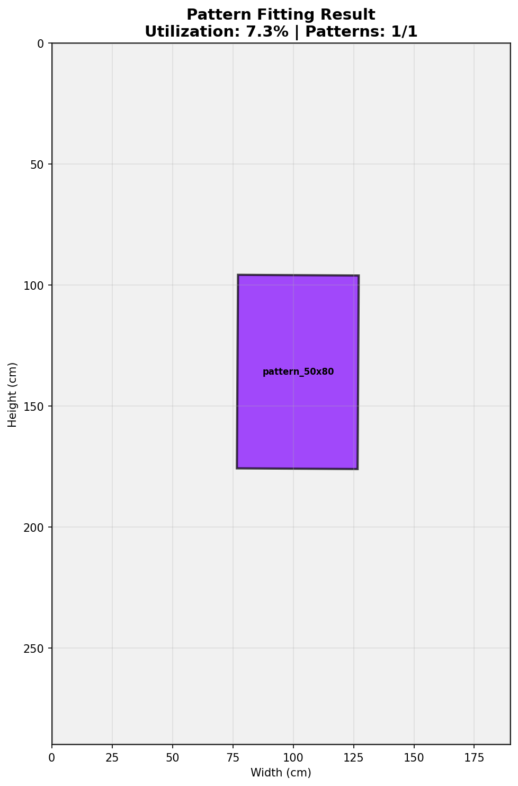

# Cutting Edge: A Simplified and Robust Pattern Fitting System

## Overview

Cutting Edge is a computer vision system that analyzes garment patterns and cloth materials to find the optimal placement for cutting, thereby minimizing fabric waste. This project has been refactored into a streamlined, robust, and easy-to-understand system that balances simplicity with powerful functionality.

The core of the system uses a combination of modern computer vision techniques and geometric analysis to achieve its goals. It avoids overly complex deep learning architectures in favor of more direct and interpretable methods, making it an excellent case study for practical computer vision applications.



## Features

- **Pattern Recognition**: Extracts pattern contours, key points, and dimensions from images. Uses a configurable CNN backbone (e.g., ResNet18) for classification and dimension estimation.
- **Cloth Material Analysis**: Analyzes cloth images to find the main contour, detect defects, and calculate usable area. It can use a simple and effective color-based segmentation or an optional U-Net for more complex cases.
- **Geometric Pattern Fitting**: Optimizes pattern placement using the `shapely` library for precise geometric calculations. It tests multiple rotations and flips to find the best fit.
- **Heuristic-Based Scoring**: The placement quality is determined by a clear scoring system that rewards material utilization, compactness, and edge placement.
- **Neural-Assisted Optimization**: An optional, simple neural network can be used to suggest promising placements, speeding up the search process.
- **Comprehensive Visualization & Reporting**: Generates detailed visual plots of the final layout and text-based reports with key metrics.
- **Fully Configurable**: All important parameters and magic numbers are centralized in `src/cutting_edge/config.py` for easy tuning.

## How It Works

The system is organized into three main modules that work in sequence:

### 1. Pattern Recognition (`pattern_recognition_module.py`)

This module takes pattern images as input and uses a combination of classic computer vision (OpenCV) and a PyTorch-based neural network to extract all necessary information.

- **Input**: A path to a pattern image.
- **Process**:
    1.  Extracts the main contour of the pattern using thresholding and morphological operations.
    2.  Uses a `PatternRecognizer` neural network (with a configurable backbone like ResNet18) to classify the pattern type (e.g., "shirt", "sleeve") and estimate its dimensions.
    3.  Calculates the area and identifies key points.
- **Output**: A `Pattern` object containing all the extracted data.

### 2. Cloth Recognition (`cloth_recognition_module.py`)

This module analyzes the cloth image to prepare it for fitting.

- **Input**: A path to a cloth image.
- **Process**:
    1.  Identifies the main usable area of the cloth, excluding the background. This can be done via a robust color-based segmentation (default) or a more advanced U-Net model (optional).
    2.  Detects defects (like holes or stains) within the cloth area.
    3.  Estimates material properties like grain direction using Gabor filters.
- **Output**: A `ClothMaterial` object describing the cloth's properties.

### 3. Pattern Fitting (`pattern_fitting_module.py`)

This is where the optimization happens. The module takes the patterns and the cloth data and finds the best layout.

- **Input**: A list of `Pattern` objects and one `ClothMaterial` object.
- **Process**:
    1.  Converts all pattern and cloth contours into `shapely` Polygons for precise geometric operations.
    2.  For each pattern, it searches for the best placement location, rotation, and orientation (flipped or not).
    3.  The search is a hybrid approach: it uses a grid search and can be guided by an optional `PlacementOptimizer` neural network.
    4.  Each potential placement is checked for validity (no overlaps, within cloth boundaries, avoids defects) and given a score based on heuristics (e.g., edge placement, compactness).
- **Output**: A dictionary containing the list of placed patterns, final utilization metrics, and paths to the generated report and visualization.

## Installation

```bash
# Clone the repository
git clone https://github.com/gdxbs/CuttingEdge
cd CuttingEdge

# Create and activate a virtual environment (using uv)
uv venv
source .venv/bin/activate  # Unix
.venv\Scripts\activate     # Windows

# Install dependencies
uv pip install -e ".[dev]"
```

## Usage

### Extracting Panel Dimensions

Before running pattern fitting, you may want to extract panel dimensions from your dataset. The `extract_panel_dimensions.py` script processes garment pattern specifications and generates individual panel images.

```bash
# Generate SVG panels (default, vector format)
python extract_panel_dimensions.py \
    --data-root ./data \
    --output-root ./images/shape \
    --format svg

# Generate PNG panels (raster format, useful for computer vision)
python extract_panel_dimensions.py \
    --data-root ./data \
    --output-root ./images/shape \
    --format png

# Note: PNG format requires cairosvg or svglib+reportlab libraries
# Install with: pip install cairosvg
```

The script creates an organized directory structure:
- `images/shape/<garment_type>/<panel_name>/panel_<WIDTH>x<HEIGHT>_<ID>.<ext>`
- A manifest CSV file with all panel metadata

### Running the Pattern Fitting System

The system can be run in several modes via `src/cutting_edge/main.py`.

### Demo Mode (Recommended)

This mode automatically finds images in your `images/` directory, splits them into a virtual train/test set, and runs the fitting process on a few test examples.

```bash
python -m src.cutting_edge.main --mode demo --num_patterns 3
```

### Fitting Specific Files

You can run the fitting process on your own selection of pattern and cloth images.

```bash
python -m src.cutting_edge.main --mode fit \
    --patterns images/shape/pattern_50x80.png images/shape/pattern_30x40.png \
    --cloth images/cloth/cloth_200x300.jpeg
```

### Training Mode

This mode runs the (currently placeholder) training functions for the models. It will save the initial model weights to the `models/` directory.

```bash
python -m src.cutting_edge.main --mode train
```

## Configuration

The entire system is highly configurable via a single file: `src/cutting_edge/config.py`. Here you can easily tweak parameters for image processing, model architecture, fitting heuristics, and more.

```python
# Example from config.py

# Pattern recognition settings
PATTERN = {
    "IMAGE_SIZE": 256,
    "BACKBONE": "resnet18",  # Options: "simple", "resnet18", "efficientnet-b0"
    ...
}

# Cloth recognition settings
CLOTH = {
    "USE_UNET": False,  # Whether to use U-Net or color-based segmentation
    "EDGE_MARGIN": 5,  # Safety margin from edges (cm)
    ...
}

# Pattern fitting settings
FITTING = {
    "ROTATION_ANGLES": [0, 90, 180, 270],
    "ALLOW_FLIPPING": True,
    "USE_NEURAL_OPTIMIZER": True,
    ...
}
```

## Development

The project follows standard Python development practices. See `CLAUDE.md` for detailed guidelines.

```bash
# Run tests
pytest

# Format code
black .
isort .

# Lint
ruff check .
mypy .
```
